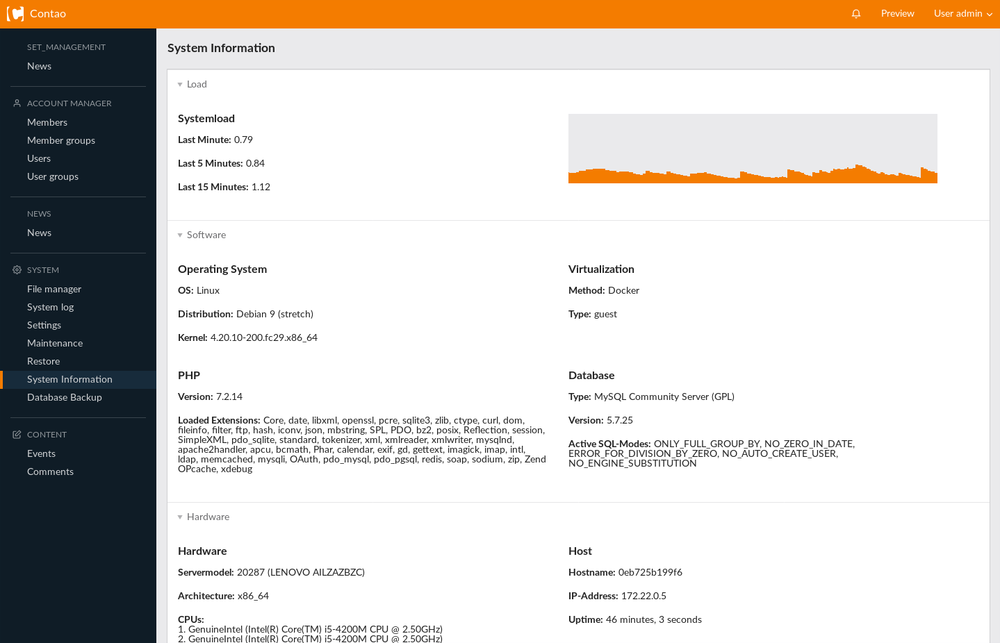
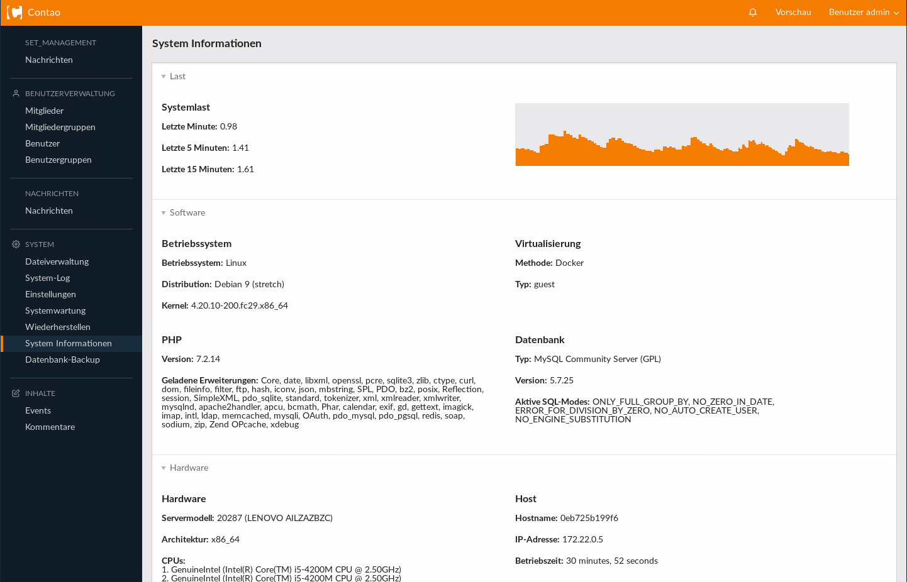

# System Information Bundle for Contao Open Source CMS

This bundle allows you to view different basic facts about the environment your Contao instance is running in,
like information about PHP, database, operating system, host, hardware, virtualization and system load (including a live system load graph).

##!!! Attention !!!
This needs access to /proc and /sys to work properly.

## Installation

Install the bundle via Composer:

```
composer require eikona-media/contao-system-information
```

Afterwards clear cache:

```
vendor/bin/contao-console cache:clear --no-warmup
vendor/bin/contao-console cache:warmup
```

Now, there is a new menu entry in the System section called 'System Information', routing you to the new system information page. 


## Screenshots




----
 

# System Information Bundle für Contao Open Source CMS

Dieses Bundle zeigt verschiedene Fakten über die Umgebung an, in der die aktuelle Contao Instanz läuft,
wie Informationen über PHP, Datenbank, Betriebssystem, Host, Hardware, Virtualisierung und Systemlast (inklusive einer Live-Grafik der aktuellen Systemlast).

##!!! Achtung !!!
Der Zugriff auf /proc und /sys muss gewährleistet sein damit dieses Bundle funktioniert.

## Installation

Das Bundle kann einfach via Composer installiert werden:

```
composer require eikona-media/contao-system-information
```

Danach sollte der Cache einmal geleert werden:

```
vendor/bin/contao-console cache:clear --no-warmup
vendor/bin/contao-console cache:warmup
```

Es erscheint nun ein neuer Menü-Eintrag in der System Sektion namens 'System Informationen', welcher zur neuen Informationsseite leitet.


## Screenshots


